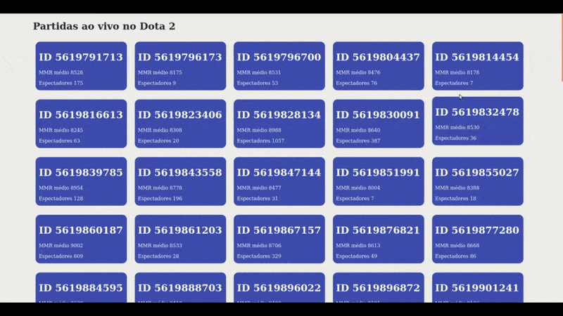

# Dota 2 Live Games
É o seu site para acompanhar as partidas que estão acontecendo nesse exato momento no dota 2.

# Motivação
Aprender um pouco sobre a tecnologia nextjs e seus casos de uso.

# Como executar esse projeto

Tenha instalado o [NODEJS](https://nodejs.org/en/download/)

Tenha instalado o [Yarn](https://yarnpkg.com/)

Clone esse projeto
<pre>git clone https://github.com/MiguelBragaGarcia/primeira-aplicacao-nextjs.git</pre>

Instale todas as dependências
<pre>yarn install</pre>

Execute o servidor
<pre>yarn dev</pre>

Abra o link que aparecerá no console
